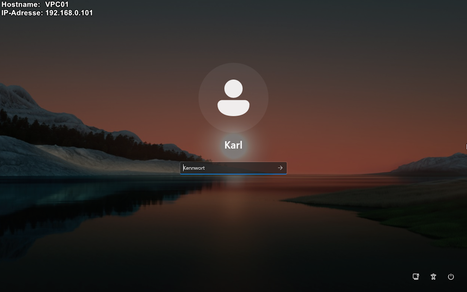
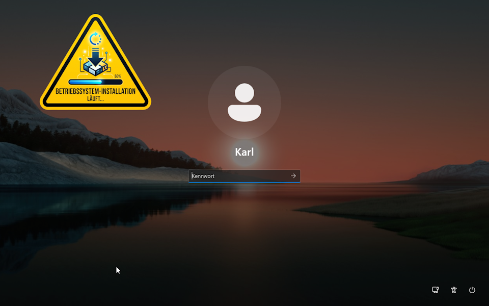

# WLSOverlay - Hilfe & Dokumentation

## Beschreibung der Features
**WLSOverlay** ist ein nützlicher Windows-Dienst, der ein anpassbares Overlay direkt auf dem Windows-Anmelde- und Sperrbildschirm (Logon/Lock Screen) anzeigt. 

**Hauptfunktionen:**
* **Drei Anzeige-Modi:**
  * **Textdatei:** Liest formatierten Text aus einer lokalen Datei (`overlay.txt`).
  * **Bilddarstellung:** Zeigt ein transparentes Bild an (`overlay.png`).
  * **Registry-Text:** Bezieht dynamischen Text direkt aus einem angegebenen Windows-Registry-Wert (ideal für Skripte oder Systeminfos).
* **Präfix-Unterstützung:** Lädt eine optionale `overlay_prefix.txt`, deren Inhalt immer vor dem Haupttext angezeigt wird (funktioniert in den Modi Textdatei und Registry-Text).
* **Live-Aktualisierung (Hot-Reloading):** Der Dienst überwacht Konfigurations- und Dateipfade in Echtzeit. Änderungen an den Textdateien, dem Bild, den Einstellungen in der Registry oder dem überwachten dynamischen Registry-Wert werden *sofort und ohne Neustart* auf dem Bildschirm aktualisiert.
* **Umfassende Anpassungsmöglichkeiten:** Flexible Steuerung von Position, Verankerung an den 4 Bildschirmecken (Anchor), Deckkraft (Opacity), Schriftart, Schriftgröße, Tabulatorbreite und Textausrichtung. Die Schrift verwendet automatisch einen starken Kontrastrahmen (weiß auf schwarz / schwarz auf weiß) für optimale Lesbarkeit auf beliebigen Hintergründen.
* **Sichere Integration:** Der Dienst läuft unsichtbar im Hintergrund, dupliziert die Sicherheitstokens korrekt und bringt das Overlay auf den abgesicherten `WinSta0\Winlogon` Desktop.

**Beispielbilder:**




---

## Installation
1. **Dateien platzieren:** Kopieren Sie die kompilierte ausführbare Datei (z.B. `WLSOverlay.exe`) in das gewünschte Installationsverzeichnis.
2. **Ordnerstruktur:** Erstellen Sie im exakt gleichen Verzeichnis einen Unterordner mit dem Namen `OverlayFiles`.
3. **Inhalte hinterlegen:** Legen Sie Ihre anzuzeigende Datei in den Ordner `OverlayFiles`:
   * Für Modus 0: `overlay.txt` (und optional `overlay_prefix.txt`)
   * Für Modus 1: `overlay.png`
4. **Als Dienst registrieren:** Öffnen Sie die Eingabeaufforderung (cmd.exe) als Administrator und führen Sie folgenden Befehl aus (passen Sie den Pfad an). Der Parameter `/s` signalisiert der EXE, dass sie im Service-Modus starten soll:
   ```cmd
   sc create WLSOverlayService binPath= "C:\Pfad\zu\WLSOverlay.exe /s" start= auto
   ```
5. **Dienst starten:** Starten Sie den Dienst anschließend mit:
   ```cmd
   sc start WLSOverlayService
   ```

---

## Beschreibung der Registry-Werte
Die gesamte Konfiguration des Overlays findet über die Windows-Registry statt. 
Navigieren Sie zum Schlüssel:
`HKEY_LOCAL_MACHINE\Software\KWI-Software\WLSOverlay`

*(Tipp: Sie können diese Werte ändern, während das Overlay angezeigt wird. Die Änderungen werden sofort übernommen.)*

### Alle Konfigurationswerte im Detail

| Wertname | Typ | Beschreibung |
| :--- | :--- | :--- |
| **OverlayType** | `REG_DWORD` | **Modus der Anzeige:**<br>`0` = Textdatei (`overlay.txt`)<br>`1` = Bilddatei (`overlay.png`)<br>`2` = Dynamischer Registry-Text |
| **Opacity** | `REG_DWORD` | Deckkraft des Overlays in Prozent (Werte: `0` bis `100`). |
| **PosX** | `REG_DWORD` | Horizontaler Abstand (X-Achse) vom gewählten Ankerpunkt in Pixeln. |
| **PosY** | `REG_DWORD` | Vertikaler Abstand (Y-Achse) vom gewählten Ankerpunkt in Pixeln. |
| **Anchor** | `REG_DWORD` | **Bildschirm-Ankerpunkt:**<br>`0` = Oben Links<br>`1` = Oben Rechts<br>`2` = Unten Links<br>`3` = Unten Rechts |
| **FontSize** | `REG_DWORD` | Schriftgröße in Pixeln (erlaubte Werte: `6` bis `149`). |
| **IsWhiteText** | `REG_DWORD` | **Textfarbe:**<br>`1` = Weißer Text mit schwarzer Umrandung<br>`0` = Schwarzer Text mit weißer Umrandung |
| **TextAlignment** | `REG_DWORD` | **Textausrichtung:**<br>`0` = Linksbündig<br>`1` = Zentriert<br>`2` = Rechtsbündig |
| **TabWidth** | `REG_DWORD` | Tabulatorbreite im Text (erlaubte Werte: `1` bis `32`). |
| **AutoHidePrefix** | `REG_DWORD` | **Sichtbarkeits-Verhalten:**<br>`1` = Versteckt das Overlay (inkl. Präfix), wenn der Haupttext leer ist.<br>`0` = Zeigt das Präfix immer an, auch wenn der Haupttext leer ist. |
| **FontFamily** | `REG_SZ` | Name der Schriftart (z.B. `Arial`, `Consolas`, `Tahoma`). |
| **TargetRegKey** | `REG_SZ` | *(Nur für OverlayType 2)*: Pfad des zu überwachenden Registry-Schlüssels (z.B. `HKLM\Software\MeineApp`). Unterstützte Roots: `HKCU`, `HKLM`, `HKCR`, `HKU`. |
| **TargetRegValue** | `REG_SZ` | *(Nur für OverlayType 2)*: Name des Wertes (`REG_SZ` oder `REG_MULTI_SZ`) im angegebenen Zielschlüssel, dessen Text im Overlay angezeigt werden soll. |

---

## Lizenz und Urheberrecht
Dieses Projekt ist lizenziert unter der **Apache License, Version 2.0**.

**Copyright 2026 Karl Wintermann (kwi-software)**

Eine Kopie der Lizenz finden Sie unter:
http://www.apache.org/licenses/LICENSE-2.0

Soweit nicht gesetzlich vorgeschrieben oder schriftlich vereinbart, wird die Software unter dieser Lizenz "WIE BESEHEN" UND OHNE JEGLICHE GARANTIEN ODER BEDINGUNGEN, weder ausdrücklich noch stillschweigend, vertrieben. Spezifische sprachliche Bestimmungen und Einschränkungen finden Sie in der Lizenz.

**Kontakt & Quelle:**
* GitHub: [kwi-software](https://github.com/kwi-software)
* E-Mail: `kwi-software(at)proton.me`